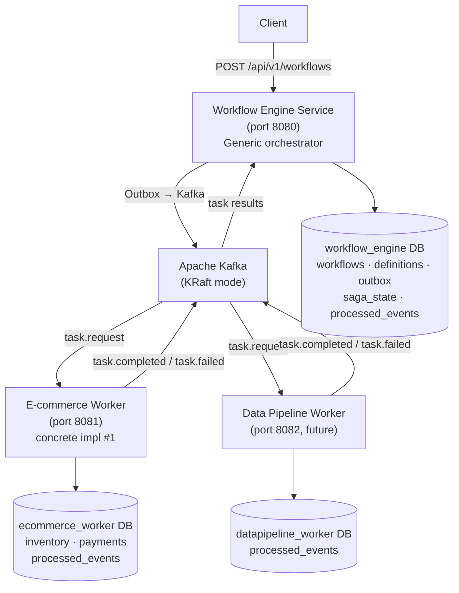

# Distributed Workflow Engine

> **Goal**: Build a generic, domain-agnostic workflow orchestration engine as a **multi-service distributed system**. A central **Workflow Engine** service accepts async jobs via REST, orchestrates them over Kafka by dispatching **tasks** to independent **worker services**, and tracks state in PostgreSQL. The engine core never changes when a new domain is added — new business logic ships as a new worker service. Demonstrates Kafka expertise, microservices architecture, Saga/Outbox patterns, retry + DLQ handling, and distributed systems design.

---

## 🧭 Architecture Overview



> **Key design point**: The **Workflow Engine** is fully domain-agnostic. It knows only `taskType` names and workflow definitions (an ordered list of task types) — never *what* a task does. Worker services implement `TaskHandler` (from the shared `worker-sdk`) and execute tasks. Adding a new domain = deploying a new worker service + inserting one workflow-definition row. **Zero engine changes.**

### Services

| Service | Port | Responsibility |
|:---|:---|:---|
| `workflow-engine-service` | 8080 | Accepts workflows, dispatches tasks, runs the saga state machine, handles compensation |
| `ecommerce-worker-service` | 8081 | Executes e-commerce tasks (validate, reserve-inventory, process-payment, notify) + compensations |
| `datapipeline-worker-service` | 8082 | *(future)* Executes data-pipeline tasks — proves the engine never changes |

### End-to-End Flow (E-Commerce Demo)

1. **POST /api/v1/workflows** `{ "type": "ecommerce-order", "payload": { ... } }` → `WorkflowService` writes `Workflow` + `OutboxEvent` in one DB transaction
2. **OutboxPoller** (`@Scheduled 1s`) reads `PENDING` events, publishes `workflow.started` to Kafka, marks `PUBLISHED`
3. **WorkflowStartedConsumer** (engine) loads the DB-backed workflow definition and starts the `SagaStateMachine`
4. **TaskDispatcher** (engine) publishes `task.request` `{ taskType: "reserve-inventory", ... }`
5. **E-commerce Worker** consumes it, routes to `ReserveInventoryTask` via `TaskHandlerRegistry`, executes, publishes `task.completed`
6. **TaskResultConsumer** (engine) advances the state machine and dispatches the next task — repeating until all tasks succeed
7. **On failure**: `CompensationPlanner` walks completed tasks in reverse and dispatches `task.request` with `action=COMPENSATE`
8. **DLQ**: After 3 retries, `DeadLetterPublishingRecoverer` sends to `.DLT` topics (per service)
9. **GET /api/v1/workflows/{id}/status** → full saga state with step-by-step timeline

---

## 🗂️ Project Structure (Monorepo)

```
distributed-workflow-engine/
├── pom.xml                                # Parent POM (multi-module)
├── docker-compose.yml                     # Kafka 3.7, PostgreSQL × 2, Kafka UI
├── README.md
├── docs/
│   └── DESIGN_DECISIONS.md
│
├── shared/                                # ── LIBRARIES (not services) ──
│   ├── engine-contract/                   # Wire contract — single source of truth
│   │   └── src/main/java/com/workflow/contract/
│   │       ├── event/
│   │       │   ├── WorkflowStartedEvent.java
│   │       │   ├── TaskRequestEvent.java          # taskId, taskType, action, payload, correlationId
│   │       │   ├── TaskResultEvent.java           # taskId, status, result, error
│   │       │   ├── WorkflowCompletedEvent.java
│   │       │   └── WorkflowCompensatedEvent.java
│   │       ├── enums/
│   │       │   ├── WorkflowStatus.java            # PENDING, RUNNING, COMPLETED, FAILED, COMPENSATED
│   │       │   ├── TaskStatus.java                # SUCCESS, FAILED
│   │       │   ├── TaskAction.java                # EXECUTE, COMPENSATE
│   │       │   └── OutboxStatus.java              # PENDING, PUBLISHED
│   │       └── dto/
│   │           └── WorkflowDefinition.java        # type → ordered List<String> taskTypes
│   │
│   └── worker-sdk/                        # Worker-side framework — reusable
│       └── src/main/java/com/workflow/worker/
│           ├── TaskHandler.java           # interface: taskType(), execute(ctx), compensate(ctx)
│           ├── TaskContext.java           # taskId, workflowId, payload, correlationId
│           ├── TaskResult.java            # SUCCESS / FAILURE with error details
│           ├── TaskHandlerRegistry.java   # routes taskType → handler
│           ├── WorkerKafkaConfig.java     # shared consumer/producer config + error handler
│           ├── CorrelationIdUtil.java     # MDC + Kafka header propagation
│           └── JsonUtil.java
│
├── services/
│   ├── workflow-engine-service/           # Port 8080 — THE generic brain
│   │   ├── pom.xml
│   │   └── src/main/java/com/workflow/engine/
│   │       ├── WorkflowEngineApplication.java
│   │       ├── api/
│   │       │   ├── WorkflowController.java        # POST /workflows, GET /workflows/{id}, status
│   │       │   ├── AdminController.java           # DLQ replay, force-fail, retry
│   │       │   └── dto/
│   │       │       ├── SubmitWorkflowRequest.java # type + payload (Map<String,Object>)
│   │       │       ├── WorkflowStatusResponse.java
│   │       │       └── ApiError.java
│   │       ├── domain/
│   │       │   ├── Workflow.java                  # id, type, status, payload JSONB, correlationId
│   │       │   ├── WorkflowDefinitionEntity.java  # type, orderedTaskTypes JSONB
│   │       │   ├── OutboxEvent.java               # Outbox table entity
│   │       │   ├── SagaState.java                 # workflowId, currentStep, completedSteps JSONB, status
│   │       │   ├── ProcessedEvent.java            # Idempotency dedup
│   │       │   └── repository/                    # 5 repositories (Outbox uses @Lock(PESSIMISTIC_WRITE))
│   │       ├── engine/                            # ── NEVER domain-specific ──
│   │       │   ├── SagaStateMachine.java          # generic FSM: advance / fail / complete
│   │       │   ├── TaskDispatcher.java            # builds + publishes TaskRequestEvent
│   │       │   ├── CompensationPlanner.java       # reverses completed tasks
│   │       │   └── WorkflowDefinitionService.java # loads definition from DB
│   │       ├── messaging/
│   │       │   ├── OutboxPoller.java              # @Scheduled, PESSIMISTIC_WRITE lock
│   │       │   ├── WorkflowStartedConsumer.java
│   │       │   ├── TaskResultConsumer.java        # task.completed / task.failed
│   │       │   ├── DlqMonitor.java                # Logs DLT messages
│   │       │   └── config/
│   │       │       ├── KafkaProducerConfig.java   # idempotent + transactional
│   │       │       ├── KafkaConsumerConfig.java   # read_committed, manual ack, error handler
│   │       │       └── KafkaTopicConfig.java      # Topic bean definitions
│   │       ├── service/
│   │       │   ├── WorkflowService.java           # Outbox Pattern — atomic writes
│   │       │   └── IdempotencyService.java        # DB unique constraint dedup
│   │       ├── common/
│   │       │   ├── exception/ (DuplicateEventException, RetryableException, InvalidPayloadException, TaskFailedException)
│   │       │   └── util/ (CorrelationIdUtil, JsonUtil, CorrelationIdFilter)
│   │       ├── monitoring/
│   │       │   └── WorkflowMetrics.java           # Micrometer counters/gauges
│   │       └── resources/
│   │           ├── application.yml
│   │           └── db/migration/
│   │               ├── V1__create_workflows_table.sql
│   │               ├── V2__create_workflow_definitions_table.sql   # seed ecommerce-order
│   │               ├── V3__create_outbox_table.sql
│   │               ├── V4__create_saga_state_table.sql
│   │               └── V5__create_processed_events_table.sql
│   │
│   └── ecommerce-worker-service/          # Port 8081 — concrete impl #1
│       ├── pom.xml
│       └── src/main/java/com/workflow/ecommerce/
│           ├── EcommerceWorkerApplication.java
│           ├── task/                                  # each implements TaskHandler
│           │   ├── ValidateOrderTask.java
│           │   ├── ReserveInventoryTask.java          # Simulates inventory reservation
│           │   ├── ProcessPaymentTask.java            # 90% success / 10% failure
│           │   ├── SendNotificationTask.java          # Simulates email/SMS notification
│           │   └── compensating/
│           │       ├── ReleaseInventoryTask.java      # Compensates ReserveInventoryTask
│           │       └── RefundPaymentTask.java         # Compensates ProcessPaymentTask
│           ├── messaging/
│           │   ├── TaskRequestConsumer.java           # routes via TaskHandlerRegistry
│           │   └── config/
│           ├── domain/                                # OWN database
│           │   ├── Inventory.java
│           │   ├── Payment.java
│           │   ├── ProcessedEvent.java
│           │   └── repository/
│           └── resources/
│               ├── application.yml
│               └── db/migration/ (inventory, payments, processed_events)
│
└── services/datapipeline-worker-service/   # future — proves "zero engine changes"
```

---

## 🔑 Patterns Demonstrated

| Pattern | Implementation | Key Design Decision |
|:---|:---|:---|
| **Outbox Pattern** | `WorkflowService` writes Workflow + OutboxEvent in single `@Transactional`; `OutboxPoller` publishes to Kafka | Chose polling (`@Scheduled`) over CDC (Debezium) — simpler setup, identical pattern |
| **Saga (Task-based Orchestration)** | Engine's `SagaStateMachine` dispatches `task.request` events; workers execute tasks and reply `task.completed`/`task.failed`; `CompensationPlanner` walks backward on failure | Orchestration (central state machine) + choreography (event-driven task dispatch) — mirrors Temporal/Conductor |
| **Pluggable Workers** | `TaskHandler` interface in `worker-sdk`; `TaskHandlerRegistry` routes `taskType` → handler | New domains = new worker services + one definition row. Engine code never changes. |
| **Idempotent Consumers** | Each service owns a `processed_events` table with UNIQUE `message_id` constraint | Dedup enforced on **both sides of every hop** (engine + workers) — at-least-once → effectively-once |
| **DLQ with Retry** | Per-service `DefaultErrorHandler` + `DeadLetterPublishingRecoverer` — 3 retries × 2s, then DLT | `InvalidPayloadException` skips retry → DLT immediately (non-retryable) |
| **Correlation ID Tracing** | `CorrelationIdFilter` → MDC → Kafka headers → propagated across engine + worker JVMs | End-to-end traceability across HTTP → Kafka → worker → Kafka → engine |
| **Database-per-service** | Each service owns its schema; no cross-service DB access | Real data isolation — workers and engine fail independently |

---

## 🔌 Extensibility: Engine vs. Worker Separation

```
┌───────────────────────────────────────────────────────────────┐
│                 WORKFLOW ENGINE SERVICE (never changes)        │
│                                                               │
│  Workflow.java             SagaStateMachine.java              │
│  WorkflowDefinitionService TaskDispatcher.java                │
│  OutboxPoller.java         CompensationPlanner.java           │
│  WorkflowStartedConsumer   TaskResultConsumer                 │
│  DLQ / Retry / Correlation / Metrics                          │
│                                                               │
│        Kafka: task.request ⇄ task.completed / task.failed     │
├───────────────────────────────────────────────────────────────┤
│                 WORKER SERVICES (pluggable)                   │
│                                                               │
│  ┌─ ecommerce-worker-service (port 8081) ───────────────┐     │
│  │ ValidateOrderTask       ReleaseInventoryTask         │     │
│  │ ReserveInventoryTask    RefundPaymentTask            │     │
│  │ ProcessPaymentTask                                   │     │
│  │ SendNotificationTask                                 │     │
│  └───────────────────────────────────────────────────────┘     │
│                                                               │
│  ┌─ datapipeline-worker-service (port 8082, future) ─────┐    │
│  │ ExtractTask  TransformTask  LoadTask                  │    │
│  └───────────────────────────────────────────────────────┘    │
└───────────────────────────────────────────────────────────────┘
```

### How to Add a New Domain

Adding a new workflow type (e.g., "data-pipeline") requires **zero engine changes**:

```java
// 1. New worker service implements TaskHandler for each task (from worker-sdk)
@Component
public class ExtractTask implements TaskHandler {
    public String getTaskType() { return "data-extract"; }
    public TaskResult execute(TaskContext ctx) { /* ... */ }
    public TaskResult compensate(TaskContext ctx) { /* ... */ }
}

// 2. Insert one workflow-definition row in the engine's DB
// INSERT INTO workflow_definitions (type, ordered_task_types)
// VALUES ('data-pipeline', '["data-extract","data-transform","data-load"]');

// 3. Submit via API
// POST /api/v1/workflows  { "type": "data-pipeline", "payload": { "source": "s3://..." } }
```

---

## 📋 Implementation Phases

### Phase 1: Monorepo Scaffold & Infrastructure (Day 1 — ~5 hours)

- Initialize parent Maven POM (multi-module) with Java 17
- Create shared modules: `engine-contract` (event schemas + enums) and `worker-sdk` (TaskHandler, registry, Kafka plumbing)
- Dependencies: Spring Web, Spring Data JPA, Spring Kafka, Flyway, PostgreSQL Driver, Lombok, Actuator, Testcontainers, Validation, Awaitility, AssertJ
- Write `docker-compose.yml`: Kafka 3.7 (KRaft mode), PostgreSQL 16 × 2 (engine + e-commerce worker), Kafka UI
- Configure per-service `application.yml`: Kafka producer (idempotent, `acks=all`), consumer (`read_committed`, manual ack), Flyway
- Create `KafkaTopicConfig` bean: 6 topics + DLTs (`workflow.started`, `task.request`, `task.completed`, `task.failed`, `workflow.completed`, `workflow.compensated`)
- Smoke test: both services' health endpoints green, Kafka UI visible

### Phase 2: Engine Service — Outbox & Domain (Day 2 — ~8 hours)

- Write 5 Flyway migrations for the engine DB (`workflows`, `workflow_definitions`, `outbox_events`, `saga_states`, `processed_events`)
- Create 5 JPA entities: `Workflow`, `WorkflowDefinitionEntity`, `OutboxEvent`, `SagaState`, `ProcessedEvent`
- Create 5 repositories (`OutboxEventRepository` uses `@Lock(PESSIMISTIC_WRITE)`)
- Implement `WorkflowService.submitWorkflow()` — Outbox Pattern: Workflow + OutboxEvent in one transaction
- Implement `OutboxPoller` — `@Scheduled` every 1s, reads PENDING events, publishes, marks PUBLISHED
- Create DTOs: `SubmitWorkflowRequest`, `WorkflowStatusResponse`, `ApiError`
- Implement `WorkflowController`: POST /workflows, GET /workflows/{id}, GET /workflows/{id}/status
- Verify: POST workflow → engine DB writes + `workflow.started` visible in Kafka UI

### Phase 3: Engine Service — State Machine & Task Dispatch (Day 3 — ~8 hours)

- Implement `SagaStateMachine` — generic FSM: advance / fail / complete / compensate
- Implement `TaskDispatcher` — builds + publishes `TaskRequestEvent` to `task.request`
- Implement `WorkflowDefinitionService` — loads `WorkflowDefinition` (ordered task types) from DB
- Implement `WorkflowStartedConsumer` — loads definition, starts state machine, dispatches first task
- Implement `TaskResultConsumer` — consumes `task.completed` / `task.failed`, advances or compensates
- Implement `CompensationPlanner` — walks completed tasks in reverse, dispatches `action=COMPENSATE`
- Implement `IdempotencyService` + `processed_events` dedup
- Create 4 exception classes: `DuplicateEventException`, `RetryableException`, `InvalidPayloadException`, `TaskFailedException`
- Verify: engine dispatches task requests and reacts to mocked results

### Phase 4: E-Commerce Worker Service (Day 4–5 — ~8 hours)

- Scaffold `ecommerce-worker-service` depending on `worker-sdk` + `engine-contract`
- Write Flyway migrations for the worker DB (`inventory`, `payments`, `processed_events`)
- Implement 4 forward `TaskHandler`s: `ValidateOrderTask`, `ReserveInventoryTask`, `ProcessPaymentTask` (90/10 simulation), `SendNotificationTask`
- Implement 2 compensating `TaskHandler`s: `ReleaseInventoryTask`, `RefundPaymentTask`
- Implement `TaskRequestConsumer` — routes `taskType` → handler via `TaskHandlerRegistry`, publishes `task.completed` / `task.failed`
- Seed `workflow_definitions` with `ecommerce-order` → `[validate-order, reserve-inventory, process-payment, send-notification]`
- Verify end-to-end:
  - Happy path → all tasks succeed → `WorkflowStatus.COMPLETED`
  - Payment failure → compensation: refund-payment → release-inventory → `WorkflowStatus.COMPENSATED`
- Verify crash-resilience — saga state persisted after each task transition

### Phase 5: DLQ & Observability (Day 6 — ~6 hours)

- Implement `DlqMonitor` in both services — listens to `.DLT` topics, logs structured JSON
- Implement `AdminController` (engine):
  - `POST /admin/simulate/task-failure?task=process-payment&enabled=true` — generic toggle (enforced in worker)
  - `POST /admin/dlt/replay?topic=&key=` — DLQ message replay
  - `GET /admin/workflows?type=&status=` — workflow search
- Implement `CorrelationIdFilter` — extracts/generates `X-Correlation-Id` on every HTTP request
- Implement `WorkflowMetrics` — counters (`workflow.saga.completed`, `workflow.saga.compensated`) + gauge (`workflow.outbox.pending`)
- Propagate correlation ID through Kafka headers across engine + worker JVMs
- Configure Logback MDC pattern to include `correlationId` + `workflowType` in every log line
- Verify: one correlation ID traces the full journey across both services

### Phase 6: Testing & Documentation (Day 7 — ~10 hours)

- **Integration test**: Testcontainers (Kafka + 2 PostgreSQL), verify POST → engine DB → Outbox → Kafka → worker → Kafka → engine → COMPLETED, Awaitility for async assertions
- **Unit tests**:
  - `SagaStateMachineTest` — Mockito: generic happy path + compensation (domain-agnostic)
  - `EcommerceWorkerTest` — e-commerce task handler tests
  - `IdempotencyServiceTest` — dedup logic
- **README.md**: architecture diagram (Mermaid), quick-start, API table, pattern explanations, how to add new domains
- **DESIGN_DECISIONS.md**: Kafka vs RabbitMQ, Outbox polling vs Debezium, orchestration vs choreography, task-dispatch engine design, monorepo vs polyrepo
- **demo.sh**: full bash script — happy path, toggle failure, compensation, DLQ replay, metrics

---

## 🧰 Tech Stack

```
Java 17
Maven (multi-module parent POM)
Spring Boot 3.3+ (2+ independently deployable services)
Spring Kafka 3.1+
PostgreSQL 16 (one database per service, Docker)
Apache Kafka 3.7 (KRaft mode)
Flyway 10.x
Testcontainers 1.19+
Micrometer (Actuator)
Lombok
JUnit 5 + Mockito + AssertJ + Awaitility
```

---

## 📊 API Endpoints (Workflow Engine — port 8080)

| Method | Path | Description |
|:---|:---|:---|
| `POST` | `/api/v1/workflows` | Submit a workflow. Body: `{ "type": "ecommerce-order", "payload": {...} }` |
| `GET` | `/api/v1/workflows/{id}` | Get workflow + saga summary |
| `GET` | `/api/v1/workflows/{id}/status` | Get full saga state (completed tasks, current task, status) |
| `GET` | `/api/v1/workflows?type=ecommerce-order` | List workflows by type |
| `POST` | `/api/v1/admin/simulate/task-failure?task=process-payment&enabled=true` | Toggle 100% failure on any task by name (generic) |
| `POST` | `/api/v1/admin/dlt/replay?topic=&key=` | Replay a DLQ message |

---

## 📊 Kafka Topics (Generic)

| Topic | Producer | Consumer | Partitions | Purpose |
|:---|:---|:---|:---|:---|
| `workflow.started` | Engine (outbox) | Engine | 3 | New workflow submitted, starts the saga state machine |
| `task.request` | Engine | All workers | 3 | Dispatch a task — `taskType` discriminator routes to handler |
| `task.completed` | Worker | Engine | 3 | Task succeeded → advance state machine |
| `task.failed` | Worker | Engine | 3 | Task failed → trigger compensation |
| `workflow.completed` | Engine | Monitoring | 3 | Entire saga completed successfully |
| `workflow.compensated` | Engine | Monitoring | 3 | Entire saga rolled back |
| `*.DLT` | DeadLetterRecoverer | DlqMonitor | 3 | Dead letters per topic |

> **Routing note**: `task.request` is partitioned by `workflowId` for ordering; workers filter by `taskType`. One generic topic — the engine never knows a domain.

---

## 📊 Metrics (Actuator)

| Metric | Service | Type | Description |
|:---|:---|:---|:---|
| `workflow.saga.completed` | Engine | Counter | Successfully completed sagas (all types) |
| `workflow.saga.compensated` | Engine | Counter | Rolled-back sagas (all types) |
| `workflow.saga.completed{type=ecommerce-order}` | Engine | Counter | Per-type counters via tags |
| `workflow.outbox.pending` | Engine | Gauge | Current outbox backlog |
| `worker.task.completed{task=process-payment}` | Workers | Counter | Per-task execution counts |

---

## ⏱️ Time Estimate

| Phase | Task | Effort |
|:---|:---|---:|
| 1 | Monorepo scaffold + shared modules + Docker (Kafka, 2 PG, UI) | 5 hours |
| 2 | Engine service: entities + migrations + Outbox + WorkflowService + OutboxPoller | 8 hours |
| 3 | Engine service: state machine + task dispatch + result consumer + compensation | 8 hours |
| 4 | E-commerce worker service: tasks + idempotency + DLQ | 8 hours |
| 5 | DLQ monitor + correlation + metrics + admin endpoints (cross-service) | 6 hours |
| 6 | Testcontainers integration test + unit tests + README + Mermaid diagrams | 10 hours |
| **Total** | | **~45 hours** |

---

## 🎯 Files Created: ~60 files

| Layer | Count |
|:---|---:|
| Config (POMs, YAML, Docker) | 6 |
| Shared contract (events + enums + dto) | 11 |
| Worker SDK (TaskHandler, Registry, Context, Result, utils) | 7 |
| Engine service (entities, repositories, engine, messaging, api, service, common, monitoring) | 24 |
| Worker service (tasks, messaging, domain) | 12 |
| Flyway migrations (engine 5 + worker 3) | 8 |
| Exceptions | 4 |
| Tests | 6 |
| Docs | 2 |
